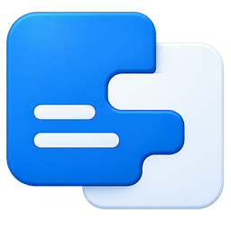

<p align="center">
  
</p>

<h1 align="center">Llyn</h1>

<p align="center">
  A personal multilingual dictionary for building a richly connected record of the words you learn.
</p>

> [!IMPORTANT]
> Llyn is pre-1.0 software under active development. The public repository currently provides source code rather than an official end-user release.

## Contents

- [Overview](#overview)
- [Features](#features)
- [Platform and requirements](#platform-and-requirements)
- [Build and run](#build-and-run)
- [Languages](#languages)
- [Data and network access](#data-and-network-access)
- [Development](#development)
- [Architecture](#architecture)
- [Repository map](#repository-map)
- [Licensing status](#licensing-status)

## Overview

Llyn is a Windows desktop application for maintaining a personal dictionary. It combines structured entries, language-specific knowledge, pronunciation work, examples, sources, and relationships between words in a local workspace.

Language packs describe how each language is presented and enriched. Optional lookups can retrieve information from external language resources for the entry the user is working on; Llyn does not ship a third-party dictionary or corpus as its own data.

The current application is a WPF graphical interface. The codebase is organized so that dictionary behavior remains independent from the interface and can also support a console interface.

## Features

- Local, workspace-based dictionary storage backed by SQLite.
- Structured entries with meanings, examples, sources, tags, registers, situations, and relationships.
- Pronunciation, transcription, respelling, audio, and language-specific phonological information.
- Search, filtering, sorting, favorites, navigation, and editing workflows.
- Language packs for modern, classical, and regional languages.
- English and Korean interface localizations.
- Optional enrichment from language-pack web sources.
- Import, export, printing, and workspace recovery support.
- A layered architecture with extensive tests and repository-specific structural audits.

## Platform and requirements

### Running a published build

The current desktop host targets:

- Windows 10 version 1809 (build 17763) or later.
- An x64 processor and operating system.
- Microsoft Edge WebView2 Runtime for printing features.

Published builds are self-contained, so they do not require a separately installed .NET runtime. No official binary release is currently available from this repository.

### Building from source

You will need:

- Windows 10 version 1809 or later.
- [Git](https://git-scm.com/).
- [.NET 10 SDK](https://dotnet.microsoft.com/download/dotnet/10.0).
- Windows PowerShell 5.1 or PowerShell 7.

## Build and run

Clone the repository and enter its root directory:

```powershell
git clone https://github.com/magnomer/Llyn.git
cd Llyn
```

Build the current source as a Release, self-contained, single-file application:

```powershell
.\scripts\Build.ps1
```

The executable is written to:

```text
build\Llyn.exe
```

Run that executable directly, or build and launch the current source snapshot with:

```powershell
.\scripts\Run.ps1
```

For a normal development build without creating the packaged executable:

```powershell
dotnet build Llyn.slnx
```

## Languages

Llyn currently contains 28 language packs. The depth of support varies by language; a pack may provide source definitions, vocabulary rules, transcription schemes, flags, or language-specific analysis.

<details>
<summary>Included language packs</summary>

- Arabic
- Cantonese
- Classical Chinese
- Classical Greek
- Classical Latin
- English
- French
- Gan
- German
- Hakka
- Hindi
- Indonesian
- Italian
- Japanese
- Jin
- Korean
- Mandarin
- Portuguese
- Russian
- Sanskrit
- Southern Min
- Spanish
- Swahili
- Tagalog
- Thai
- Vietnamese
- Wu
- Xiang

</details>

The application interface is currently localized in English and Korean.

## Data and network access

Llyn keeps dictionary data in a workspace selected by the user. A workspace contains the SQLite database and supporting files needed for drafts, cached media, and application state. Because this is pre-1.0 software, back up an important workspace before using a new development build.

Some language-pack features contact external web sources when the user requests a lookup. Retrieved material is stored in the user's workspace and remains subject to the source provider's terms and the licence attached to the material. Network availability and changes to third-party sites can affect those features.

## Development

Run the complete test suite:

```powershell
.\scripts\Test.ps1
```

Run the complete repository gate—build, tests, and all architectural and convention audits:

```powershell
.\scripts\Check.ps1
```

Useful narrower test commands include:

```powershell
# Convention tests only
.\scripts\Test.ps1 -Convention

# Portable tests and convention tests
.\scripts\Test.ps1 -Platform Internal

# Tests affected by a named symbol, plus convention tests
.\scripts\Test.ps1 LDatabaseSessionStart
```

The repository uses deliberately strict architecture, naming, comment, encoding, platform, and UI rules. Read [`Llyn.comment.md`](Llyn.comment.md) before deciding where a change belongs. The source tree may lag the target described there; the audits measure and constrain that migration.

## Architecture

The target dependency path separates presentation, shared user behavior, application workflows, the domain model, and external systems:

```text
GUI:  UIVeneer  -> UIDeportment --\
                                  \
                                   Conduct -> ShellEngine -> Application -> Core
                                  /
CUI:  UITerminal -> UIDemeanor --/

Infrastructure -> Core
Host wires the complete application together.
```

| Area | Responsibility |
|---|---|
| UIVeneer / UITerminal | Present a graphical or console surface and relay input. |
| UIDeportment / UIDemeanor | Drive that surface using medium-specific behavior. |
| Conduct | Own behavior shared by every interface and expose user-action gates. |
| ShellEngine | Connect Conduct to application workflows. |
| Application | Run workflows over the domain model. |
| Core | Define domain concepts and external-service contracts. |
| Infrastructure | Implement storage, file, and network contracts. |
| Host | Compose dependencies and start the selected interface. |

Only adjacent layers name one another. A hard boundary around Conduct prevents UI code from depending directly on the inner model. Platform-specific work is kept in platform twins rather than mixed into portable projects.

[`Llyn.comment.md`](Llyn.comment.md) is the authoritative description of the target structure, UI cut, gates, project roles, and platform twins.

## Repository map

| Path | Contents |
|---|---|
| `src/` | Application source projects. |
| `tests/` | Engine, Conduct, Windows, interface, and convention test projects. |
| `languages/` | Language-pack definitions and assets. |
| `localization/` | English and Korean interface text. |
| `themes/` | Application theme definitions. |
| `assets/` | Brand and interface artwork. |
| `scripts/` | Build, run, test, audit, tracing, and reporting tools. |
| `performance/` | Fixed workloads used for performance tracing. |
| `docs-analysis/` | Generated audit and analysis reports retained with source versions. |

Most source files have a neighboring `.comment.md` sidecar explaining their current wiring or implementation. These sidecars complement the code; they do not override the target structure in `Llyn.comment.md`.

## Licensing status

A repository-wide licence has not yet been published. Public availability on GitHub does not by itself grant permission to use, modify, or redistribute the project.

The licence at [`assets/icons/LICENSE`](assets/icons/LICENSE) applies to the third-party icon set only and does not license the rest of Llyn. Project licensing and complete third-party notices will be published separately.
